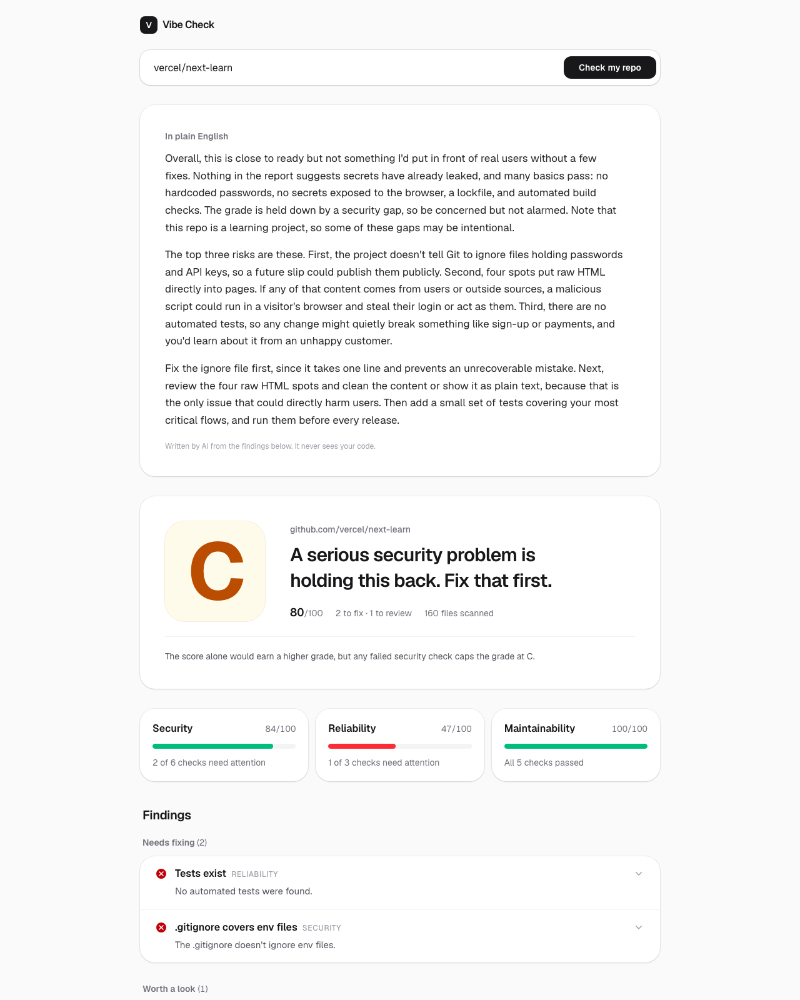

# Vibe Check

**Is your AI-built app ready for real users?** Paste a public GitHub repo and get a production-readiness grade with a plain-English report: leaked keys, missing tests, unprotected endpoints, and what to fix first.

**Live:** https://vibe-check-beige-nine.vercel.app



## What it does

- Fetches a public repo from GitHub and runs 18 checks across **Security**, **Reliability** and **Maintainability**.
- Scores it 0–100 with a letter grade. Any failed security check caps the grade at C.
- Lists each finding with the files and line numbers involved, and a fix written for a non-technical founder.
- Optionally adds a short AI summary ("what a senior engineer would tell you"), written from the findings only. It never sees your code.
- Never shows a secret's value: findings show a masked preview (`sk-ab…••••`), and `.env` files are never downloaded.

## How it's built

```
app/api/scan/route.ts     POST { url } → validate → fetch → run checks → optional summary
lib/github.ts             URL parsing, tree + file fetching (250-file cap, 10 at a time)
lib/engine/               Pure engine: RepoSnapshot in, Report out. No network, no env vars
lib/engine/checks/*.ts    One file per check
lib/summary.ts            Optional AI summary (Anthropic API), findings only
components/               Report UI
tests/                    Vitest, using tiny fake repos written inline
```

The engine is pure, so every check is tested against small fake repos built inline. The tests never touch the network. Checks are regex and file heuristics (no ASTs) and are tuned to prefer false negatives over false positives: heuristic checks like "unprotected routes" can only warn, never fail.

Stack: Next.js (App Router), TypeScript (strict), Tailwind, Vitest, deployed on Vercel. Built with Claude Code. See [`SPEC.md`](SPEC.md) for the full spec and [`PLAN.md`](PLAN.md) for the phased build plan.

## Run it locally

```bash
npm install
npm run dev        # http://localhost:3000
```

Optional environment variables (in `.env.local`):

| Variable | What it does |
|---|---|
| `GITHUB_TOKEN` | Raises GitHub's API limit from 60 to 5,000 requests/hour. A fine-grained token with public-repo read access is enough. |
| `ANTHROPIC_API_KEY` | Turns on the AI summary. The app works fully without it. |
| `ANTHROPIC_MODEL` | Overrides the model used for the summary. |

Or use the API directly:

```bash
curl -s -X POST localhost:3000/api/scan -H 'content-type: application/json' \
  -d '{"url":"https://github.com/vercel/next-learn"}'
```

Link straight to a report with `/?repo=owner/name`.

## Development

```bash
npm test           # all checks, scoring, fetching and summary tests
npm run lint
npm run build
```

CI runs lint, tests and build on every PR. Merging to `main` deploys to production on Vercel.
